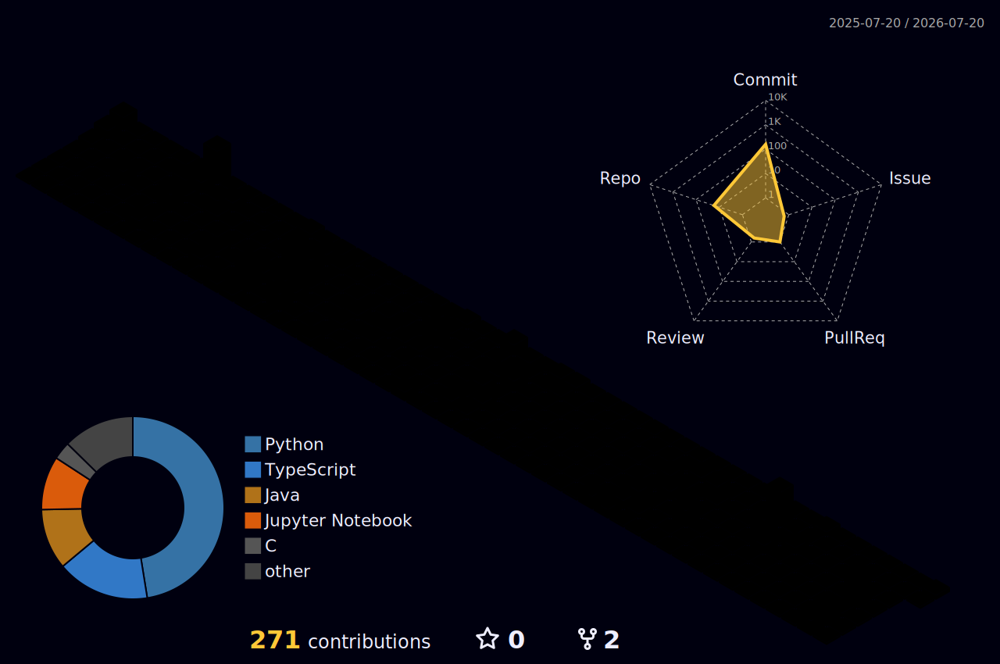

	 
	 

# Hi , I'm Krishna Chaitanya Koppaku

---

# 🚀 About Me

🎓 B.Tech in Computer Science & Engineering at **IIITDM Kancheepuram**

💡 Passionate about **Artificial Intelligence, Machine Learning, NLP, Full-Stack Development, and System Design**

🤖 Building intelligent applications using **LLMs, Agentic AI, Speech Recognition, and Computer Vision**

📄 **Research Paper Accepted at CVIP 2026**

🌱 Currently working on:
- Pilot Instruction Understanding using ASR + NLP
- Agentic AI Workspace
- AI-powered Full Stack Applications

💻 I enjoy solving real-world engineering problems and building scalable software that combines research with practical applications.

---

# 🏆 Highlights

- 📄 Research Paper accepted at **CVIP 2026**
- 🤖 Developing an **Agentic AI Workspace**
- ✈️ Building an **NLP-based Pilot Instruction Understanding System**
- 👨‍💻 Core Member – Developers Club
- 📊 MATLAB Club Coordinator
- 🎓 Class Representative
- 🚀 Passionate about Open Source & AI Research

---

# 💻 Tech Stack

### Languages

### AI / Machine Learning

### Web Development

### Tools & Platforms

---

# 📊 GitHub Statistics

---

  

---

# 🌐 Connect With Me

---

### 💡 *"Building intelligent systems that solve real-world problems through AI, software engineering, and continuous learning."*

⭐ **If you like my work, consider starring my repositories!**

